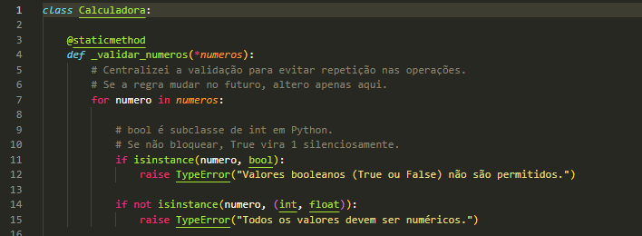
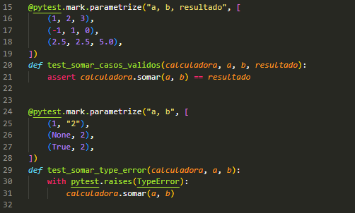
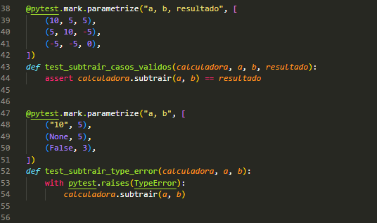
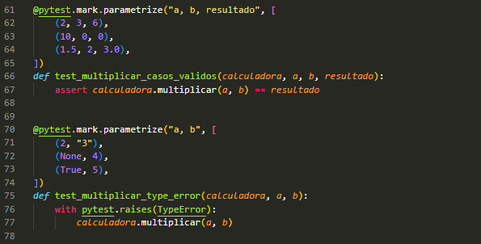
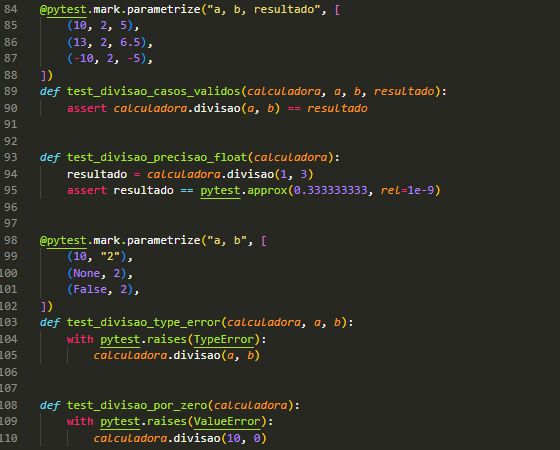
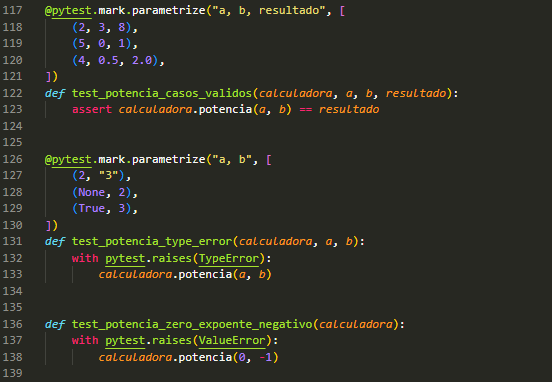
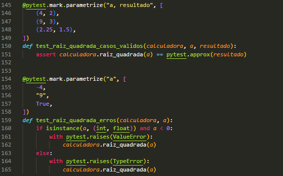

# Calculadora com Python e Pytest

# Resumo

Este projeto consiste na implementação de uma calculadora simples desenvolvida em Python, acompanhada de testes unitários utilizando **Pytest** e práticas de Test-Driven Development **(TDD)**: uma abordagem de Engenharia de Software onde os testes automatizados são escritos antes da funcionalidade ser implementada. O fluxo baseia-se em ciclos curtos: criar um teste que falha, escrever o código mínimo para passá-lo e, por fim, refatorar quantas vezes for necessário.

O objetivo é aplicar boas práticas de desenvolvimento e testes de software, garantindo **validação de entradas, tratamento de exceções e cobertura de código por meio de testes automatizados**.

---

# Sobre

O projeto inclui 6 operações matemáticas implementadas em uma classe Calculadora, além de uma suíte completa de testes utilizando **Pytest**, garantindo a validação de cada operação.

Também foram aplicadas boas práticas como:

- Validação de tipos de entrada
- Tratamento de exceções
- Testes positivos e negativos
- Medição de cobertura de código

---

# Operações Implementadas

## Validação para verificar se os valores passados para a função são booleanos ou strings e subir uma mensagem de erro caso for.


## A calculadora possui as seguintes operações:

### Soma


### Subtração


### Multiplicação


### Divisão comum e com exceção (tratamento de divisão por zero)


### Potência


### Raiz quadrada


---

# Tecnologias e Conceitos

Tecnologias utilizadas no projeto:

- **Python 3**
- **Pytest**
- **Pytest-cov** (para análise de cobertura de testes)
- **Git e GitHub**

Conceitos aplicados:

- Programação orientada a objetos
- Testes automatizados
- Cobertura de código
- Validação de entrada de dados
- Tratamento de exceções
- Estruturação de projetos Python
- Boas práticas de versionamento

---

# Dependências

Para instalar as dependências do projeto, execute:

```bash
pip install -r requirements.txt
```

---

# Execução dos Testes

Para executar os testes e verificar a cobertura de código, utilize o comando:

```bash
python -m pytest --cov=calculadora --cov-report=term-missing
```

Esse comando irá:

- Executar todos os testes  
- Mostrar a cobertura de código  
- Indicar linhas que ainda não foram testadas  

---


## Principais aprendizados

- Como estruturar um projeto Python de forma organizada  
- Implementação de testes automatizados com Pytest  
- Utilização de parametrização de testes  
- Importância da cobertura de código  
- Tratamento de exceções em operações matemáticas  
- Validação de entradas para evitar comportamentos inesperados  
- Uso de Git e GitHub para versionamento de código  

Esse projeto reforça a importância de garantir que o software funcione corretamente não apenas em cenários ideais, mas também em situações de erro ou entradas inválidas.


## Referências:
- https://medium.com/@ldeassis/test-driven-development-in-python-a-practical-guide-for-intermediate-developers-fed4a41bf04e
- https://www.thedigitalcatonline.com/blog/2020/09/11/tdd-in-python-with-pytest-part-2/


